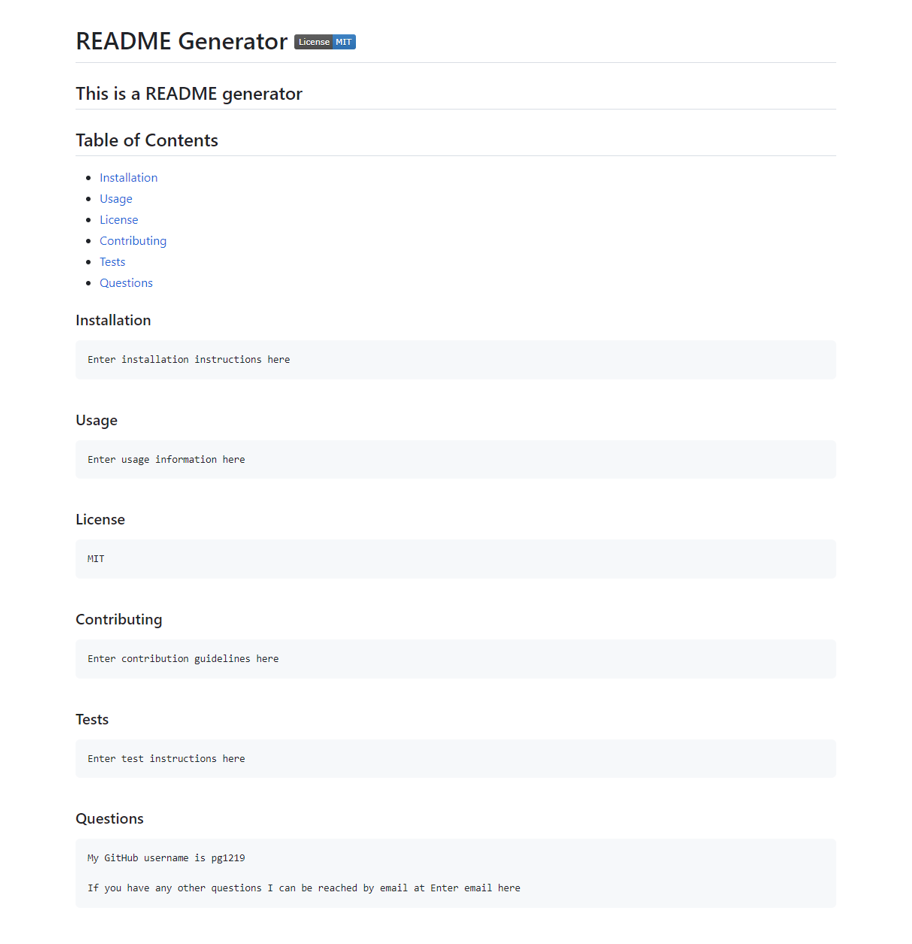

# HW-Challenge-9-README-Generator

## Description

Our objective this assignment was to create a README generator.

Main Objectives: 

- When given a command-line application I am prompted for information about my application repository
- After I enter the information, a professional README file is generated with the title of my project and sections entitled Description, Table of Contents, Installation, Usage, License, Contributing, Tests, and Questions
- The data entered is shown under the corresponding section of the README
- When a I choose from the list of License options, the chosen option apperas near the top of the file
- When I enter my GitHub and Email they are added to the Question section of the file
- When I click on a link in the Table of Contents I am taken to the corresponding section of the README

## Links

Application: https://drive.google.com/file/d/1NkDgqi9M0TQYA1yY-4zcNIUXHmdElDCi/view

Repo: https://github.com/pg1219/HW-Challenge-9-README-Generator

Sample README: https://github.com/pg1219/HW-Challenge-9-README-Generator/tree/main/sample

## Mock-Up

Preview image of deployed application

